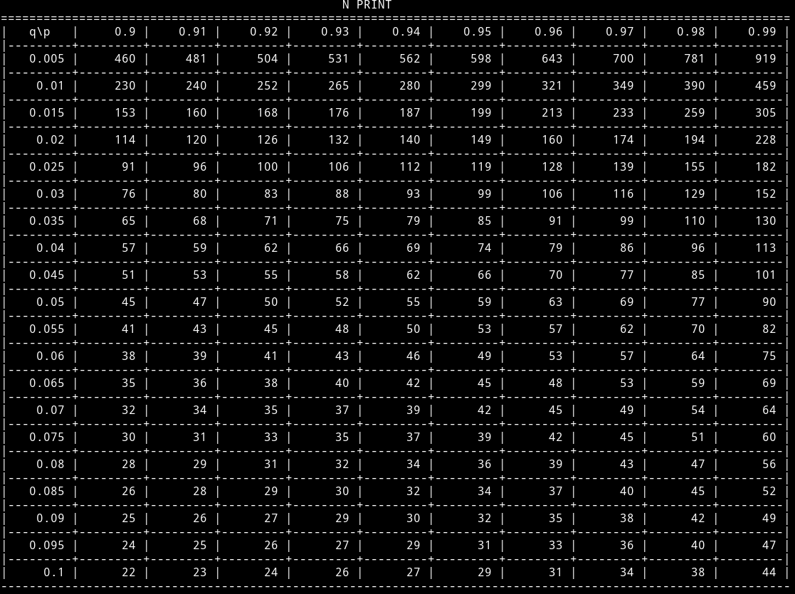
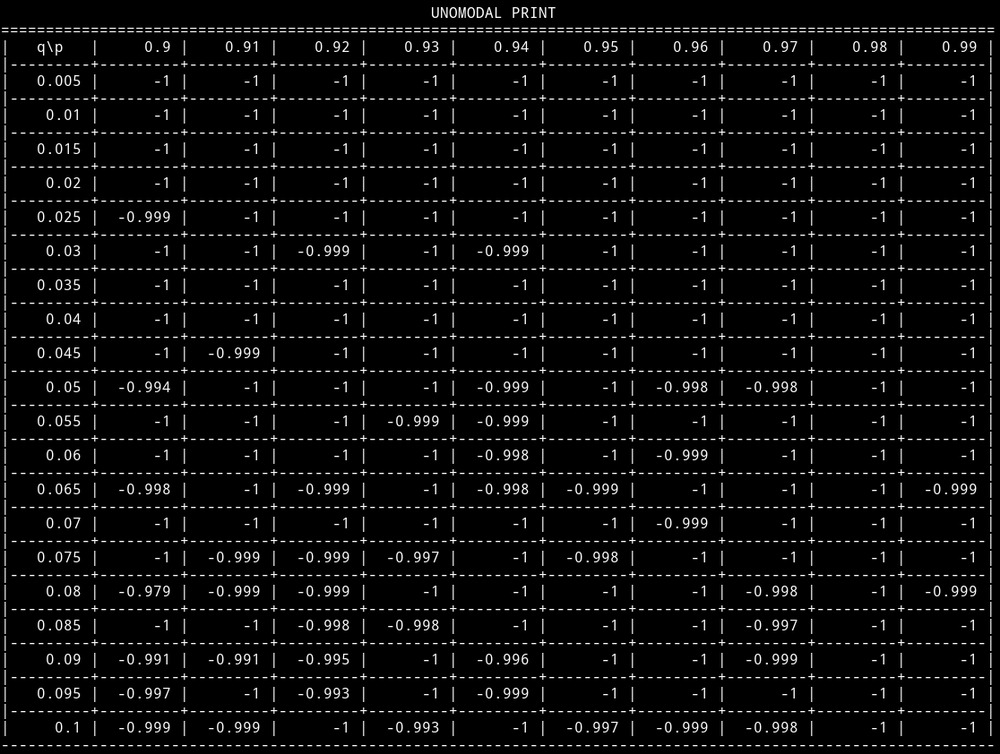
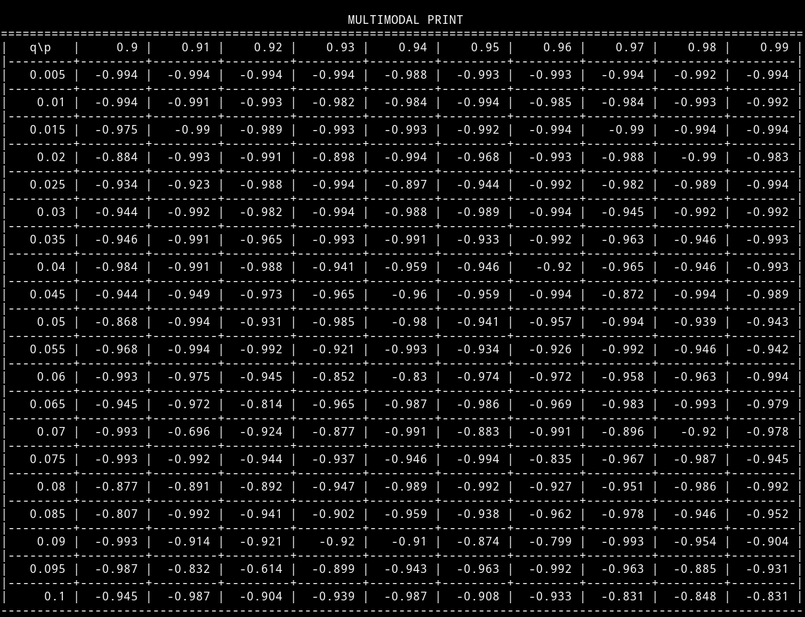

# Лабораторная работа №2 по Теории систем и системному анализу

Вариант 1
## Задание
На интервале [-5, 2] задана унимодальная функция одной переменной -0.5*sin(0.5x) - 0.5 и мультимодальная фунция одной переменной f(x) = (-0.5 * sin(0.5x) - 05) * sin(5x).
Используя метод случайного поиска осуществить поиск минимума фунции на заданном интервале с заданной вероятностью попадания в окрестность экстремума P при 
допустимой длинне интервала неопределенности.

## Выполнение лабораторной работы

Реализация работы программы находится в следующих файлах: main.cpp, randomSearcher.cpp.
Результат работы программы приведен на скриншотах.

